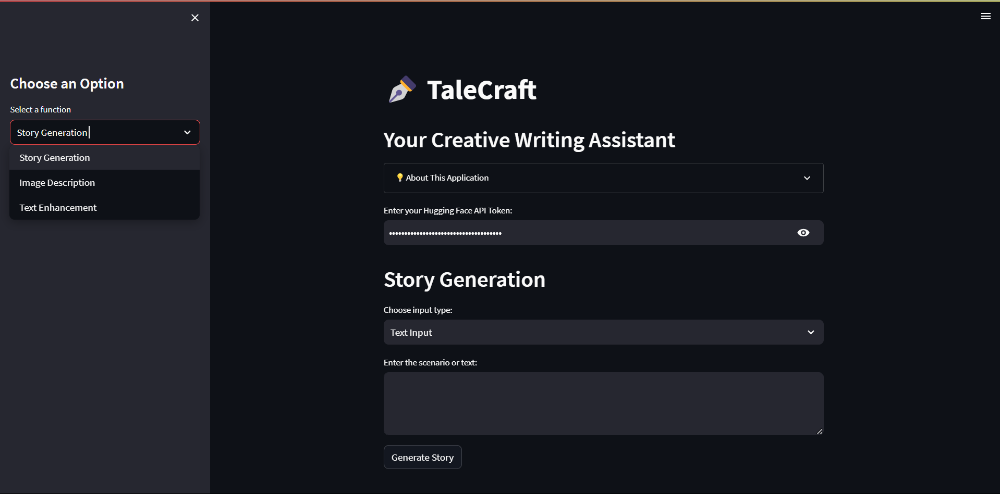
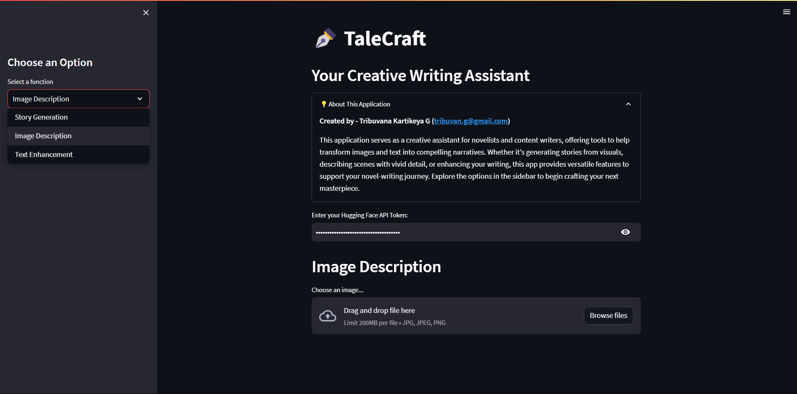

# TaleCraft: Your Creative Writing Assistant

**TaleCraft** is an assistant tool designed to help novelists and content writers generate narratives and enhance text. Whether you want to create stories from images, describe scenes like in a novel, or improve your text, TaleCraft is here to assist you in your creative writing journey.





### 1. Story Generation
Generate narratives from images or text input. Simply upload an image or type in a scenario, and TaleCraft will create a short story to inspire your writing.

### 2. Image Description
Describe an image in a detailed and novel-like manner. Perfect for writers who need to paint a vivid picture of a scene or character in their story.

### 3. Text Enhancement
Enhance and rewrite your sentences to improve their flow, style, and readability, making them suitable for a novel.

## Installation

To run this project locally, you'll need to have Python installed. Follow the steps below to set up the project:

1. Clone the repository:
   ```bash
   git clone https://github.com/tribuvan/TaleCraft.git
   cd TaleCraft
2. Create a virtual environment and activate it:
   ```bash
   python -m venv venv
   source venv/bin/activate  # On Windows: venv\Scripts\activate
3. Install the required dependencies:
   ```bash
   pip install -r requirements.txt
4. ### !!!if you are unable to upload images in streamlit app then try:
   ```bash
   pip install streamlit==1.24.0 
5. Run the Streamlit application:
   ```bash
   streamlit run app.py

## Usage

1. Launch the application in your browser.
2. Use the sidebar to select the desired feature:
   - **Story Generation:** Generate a story from an image or text input.
   - **Image Description:** Describe an image as if writing a novel.
   - **Text Enhancement:** Rewrite and enhance text for a novel-like quality.
3. Follow the prompts and start creating!

## License

This project is licensed under the MIT License. See the [LICENSE](LICENSE) file for details.
